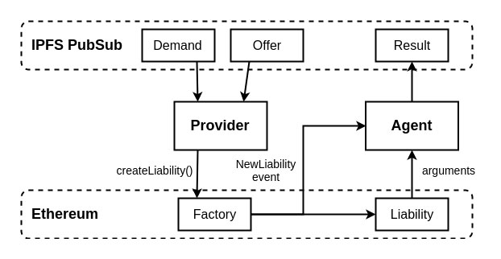

In this section we will discuss the Robonomics Network scenario.

There are few main parts in the Robonomics network:

- IPFS for the messages exchanging
- the Ethereum blockchain for storing new liability contracts
- a provider that is responsible for matching messages
- an agent

Let's have a look at the following diagram that describes the scenario without any additional details:

There are three types of [messages](/docs/market-messages) in IPFS: Demand, Offer, Result.

**Below there is the specification for a Demand message:**

| Field         | Type                      | Description                                       | Example                                           |
|-------------- |-------------------------  |------------------------------------------------   |------------------------------------------------   |
| model         | [ipfs_common/Multihash](/docs/robonomics-liability-messages#ipfs_commonmultihashmsg)     | CPS behavioral model Identifier                   | QmfXHZ2YkNC5vRjp1oAaRoDHD8H3zZznfhBPasTu348eWC    |
| objective     | [ipfs_common/Multihash](/docs/robonomics-liability-messages#ipfs_commonmultihashmsg)     | CPS behavioral model parameters in rosbag file    | QmUo3vvSXZPQaQWjb3cH3qQo1hc8vAUqNnqbdVABbSLb6r    |
| token         | ethereum_common/Address   | Operational token address                         | 0xbD949595eE52346c225a19724084cE517B2cB735        |
| cost          | ethereum_common/UInt256   | CPS behavioral model implementation cost          | 1                                                 |
| lighthouse    | ethereum_common/Address   | Lighthouse address                                | 0xa1b60ED40E5A68184b3ce4f7bEf31521A57eD2dB1       |
| validator     | ethereum_common/Address   | Observing network address                         | 0x0000000000000000000000000000000000000000        |
| validatorFee  | ethereum_common/UInt256   | Observing network commission                      | 0                                                 |
| deadline      | ethereum_common/UInt256   | Deadline block number                             | 6393332                                           |
| sender        | ethereum_common/Address   | Message sender address                            | 0x0000000000000000000000000000000000000000        |
| signature     | std_msgs/UInt8[]          | Sender’s digital signature                        | 0x23bc…c617                                       |

<!--
=============== ============================================================== ================================================ ================================================
     Field                                   Type                                                Description                                        Example
=============== ============================================================== ================================================ ================================================
  model          :ref:`ipfs_common/Multihash <IPFS-Common-Multihash.msg>`       CPS behavioral model Identifier                  QmfXHZ2YkNC5vRjp1oAaRoDHD8H3zZznfhBPasTu348eWC
  objective      :ref:`ipfs_common/Multihash <IPFS-Common-Multihash.msg>`       CPS behavioral model parameters in rosbag file   QmUo3vvSXZPQaQWjb3cH3qQo1hc8vAUqNnqbdVABbSLb6r
  token          :ref:`ethereum_common/Address <Ethereum-common-Address.msg>`   Operational token address                        0xbD949595eE52346c225a19724084cE517B2cB735
  cost           :ref:`ethereum_common/UInt256 <Ethereum-common-UInt256.msg>`   CPS behavioral model implementation cost         1
  lighthouse     :ref:`ethereum_common/Address <Ethereum-common-Address.msg>`   Lighthouse address                               0xa1b60ED40E5A68184b3ce4f7bEf31521A57eD2dB1
  validator      :ref:`ethereum_common/Address <Ethereum-common-Address.msg>`   Observing network address                        0x0000000000000000000000000000000000000000
  validatorFee   :ref:`ethereum_common/UInt256 <Ethereum-common-UInt256.msg>`   Observing network commission                     0
  deadline       :ref:`ethereum_common/UInt256 <Ethereum-common-UInt256.msg>`   Deadline block number                            6393332
  sender         :ref:`ethereum_common/Address <Ethereum-common-Address.msg>`   Message sender address                           0x0000000000000000000000000000000000000000
  signature      std_msgs/UInt8[]                                               Sender's digital signature                       0x23bc...c617
=============== ============================================================== ================================================ ================================================
-->

An Offer message has the same fields but instead of `validatorFee` there is a `lighthouseFee` field. This field determines the amount of fee for a lighthouse.

Now let's have a look at the following diagram and walk step by step from the moment of publishing messages to a liability finalization.

A liability contract is created only if the following fields match: `model`, `objective`, `token`, `cost`. A provider of Robonomics Network watches every message and finds those ones that have a match.
After the match is found the provider calls `createLiability(demand, offer)` method from the contract factory where `demand` and `offer` are serialized.

Below is the package diagram for the Robonomics communication stack:

The factory deserializes arguments and recovers *promisee* and *promisor* addresses from signatures.

Next step is token transfer. The factory transfers **cost** tokens from the *promisee* address and **validatorFee** and **lighthouseFee** from the *promisor* address to the new liability address.

> - **You should approve sufficient amount of tokens for the factory.**
> - **It's not required to approve tokens from the *promisor* address if fees are null.**

Now the factory emits a NewLiability event with the liability address. An agent gets the address, reads fields, perform a task and at the same time writes a log file in rosbag format.

When the work is done the agent sends a Result message with the following fields: hash of the rosbag file, a success flag, a signature. If the **validator** field is not null it means that only validator is able to finalize the liability.

After the successful liability finalization the agent gets **cost** tokens. Otherwise, the *promisee* gets tokens back.