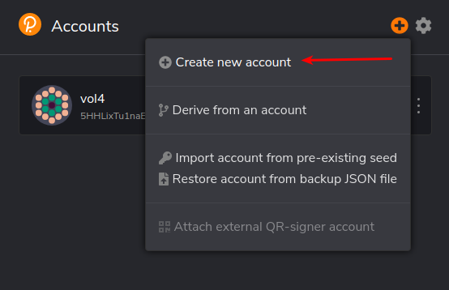
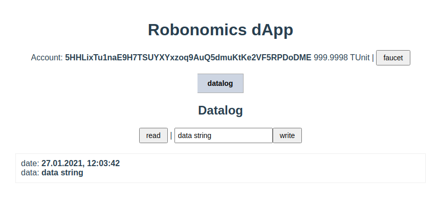
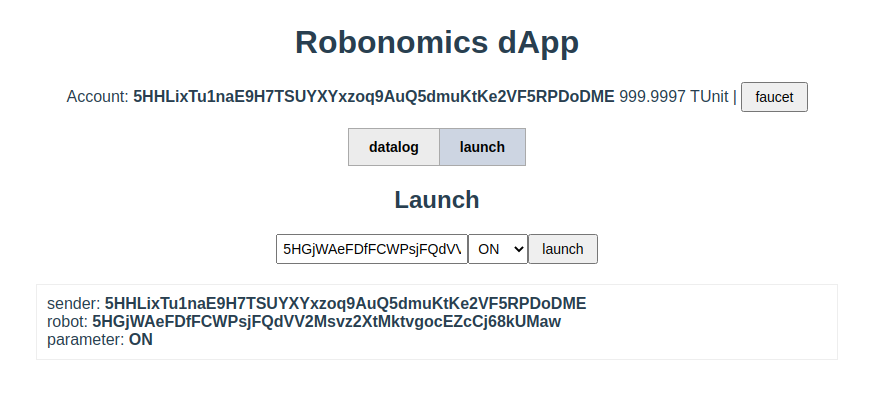

## 準備

### Robonomicsノードの立ち上げ

dAppの開発とテストには、ローカルのRobonomicsノードを使用します。そのためには、コンパイル済みのバイナリファイル https://github.com/airalab/robonomics/releases をダウンロードする必要があります。私はUbuntuを使用するので、適切なバージョンをダウンロードします。

アーカイブを解凍
```sh
wget https://github.com/airalab/robonomics/releases/download/v0.24.0/robonomics-ubuntu-0.24.0-x86_64.tar.xz
tar -xvf robonomics-ubuntu-0.24.0-x86_64.tar.xz
chmod +x robonomics
```

これでノードを開発モードで起動できるようになりました。これには --dev フラグを使います。
```sh
./robonomics --dev --tmp
```

> トラブルシューティング
```sh
./robonomics purge-chain --dev
```

### ブラウザ拡張

ブラウザに鍵を保存するために、`polkadot{.js}`という拡張機能があります。dAppでは、これを使ってトランザクションに署名します。

この拡張機能は現在、`Google chrome` と `Firefox` で利用可能です。https://polkadot.js.org/extension/ 

拡張機能をインストールしたら、新しいアカウントを作成します。 


> 最初のステップが完了しました。

## DApp 開発

### Step 1

> ここでは、vue.jsのフレームワークを使ってdAppを書きますが、好きなもの・できるものを使っても構いません。

vue.jsで起動アプリを作ってdAppの開発を始めましょう ここでは、2つの方法で行うことができます。

方法 1:

`Vue cli`コンソールユーティリティを使用する。これを行うには、`Vue cli`をインストールする必要があります。https://cli.vuejs.org/guide/installation.html 
Also we will need `yarn`. Install it from [here](https://yarnpkg.com)

インストールが完了したら、ターミナルで次のコマンドを実行します。


```sh
vue create mydapp
```

セットアップウィザードのいくつかの質問に答えます。ここでは、Vue 2バージョンを使用するので、デフォルトのバージョン`Default ([Vue 2] babel, eslint)`のままにしておきます。


方法 2:

例のために準備されたgitリポジトリをクローンして、step-1にチェックアウトする。

```sh
git clone https://github.com/airalab/example-robonomics-dapp.git mydapp
cd mydapp
git checkout step-1
```

その結果、起動アプリケーションがインストールされたディレクトリが作成され、起動してブラウザで開くことができるようになります。


```sh
yarn
yarn serve
```

### Step 2. polkadot.jsを使い始める

#### 依存関係のインストール

ロボノミクスチェーンにdAppを接続するために、`@polkadot/api`ライブラリがあります。また、キーを持つ拡張機能とdAppを連動させるためには、`@polkadot/extension-dapp`ライブラリがあります。これらをアプリケーションにインストールする必要があります。このライブラリの使い方の詳細は、ドキュメント https://polkadot.js.org/docs/ に記載されています。

方法 1:

```sh
yarn add @polkadot/api @polkadot/extension-dapp
```

また、mjs拡張をサポートするために、vue.config.jsファイルを追加する必要があります。

`vue.config.js`
```js
module.exports = {
  publicPath: "",
  configureWebpack: {
    resolve: {
      extensions: ["*", ".mjs", ".js", ".vue", ".json", ".gql", ".graphql"]
    },
    module: {
      rules: [
        {
          test: /\.mjs$/,
          include: /node_modules/,
          type: "javascript/auto"
        }
      ]
    }
  }
};
```

#### Robonomicsへの接続

まず、Robonomicsノードに接続するためのパラメータを記述した設定ファイルを作成しましょう。デモのリポジトリには、このファイル`config.template.json`の例があります。

`src/config.json`
```json
{
  "endpoint": "ws://localhost:9944",
  "types": {
    "Record": "Vec<u8>",
    "Parameter": "Bool",
    "Address": "AccountId",
    "LookupSource": "AccountId"
  }
}
```

このファイルでは、接続先のノードとカスタムタイプを指定しています。


次に、実行中のノードに接続するためのスクリプトを書きます。

`src/utils/api.js`
```js
import { ApiPromise, WsProvider } from "@polkadot/api";
import config from "../config.json";

let api;
export async function initApi() {
  const provider = new WsProvider(config.endpoint);
  api = await ApiPromise.create({
    provider,
    types: config.types
  });
  return api;
}

export function getApi() {
  return api;
}
```

拡張機能のキーを使ってトランザクションに署名できるように、拡張機能への接続用の関数と、アカウントを初期化するための関数の2つを追加しましょう。

`src/utils/api.js`
```js
...OTHER_CODE...

import {
  web3Accounts,
  web3Enable,
  web3FromAddress
} from "@polkadot/extension-dapp";

async function getExtension() {
  const extensions = await web3Enable("demo");
  if (extensions.length === 0) throw new Error("no extension");
  return extensions[0];
}

export async function initAccount(index = 0) {
  const timeout = new Promise(resolve => {
    setTimeout(resolve, 300);
  });
  await timeout;
  await getExtension();
  const accounts = await web3Accounts();
  if (accounts.length > 0) {
    const injector = await web3FromAddress(accounts[index].address);
    api.setSigner(injector.signer);
    return accounts[index].address;
  }
  throw new Error("no accounts");
}

...OTHER_CODE...
```

口座の残高はゼロですが、ちょっとした資金が必要になります。そこで、別のfaucet関数を作る必要があります。Robonomicsを --dev フラグで起動したところ、残高の多いアリスアカウントがあるので、そこから資金を要求します。

`src/utils/api.js`
```js
...OTHER_CODE...

import { Keyring } from "@polkadot/keyring";

export function getBalance(account, cb) {
  api.query.system.account(account, ({ data: { free: currentFree } }) => {
    cb(currentFree);
  });
}

export const keyring = new Keyring({ type: "sr25519" });

export async function faucet(address) {
  keyring.setSS58Format(api.registry.chainSS58);
  const account = keyring.addFromUri("//Alice");
  const tx = api.tx.balances.transfer(address, 1000000000000000);
  await tx.signAndSend(account);
}

...OTHER_CODE...
```

フルバージョンのスクリプト  https://github.com/airalab/example-robonomics-dapp/blob/master/src/utils/api.js

アプリの実行

```sh
yarn serve
```

方法 2:

リポジトリをクローンしてアプリケーションを開始した場合、このステップを完了するためには、ステップ2に切り替えて残りの依存関係をインストールするだけで十分です。

```sh
git checkout step-2
cp src/config.template.json src/config.json
yarn
yarn serve
```

### Step 3. vueをコンポーネントに接続

#### 接続

接続用のスクリプトはすでに書いてあります。あとはそれをインターフェイス上で使います。書かれた`initApi`関数を、ルートコンポーネントの`App.vue`で呼び出すだけで十分です。そして、ユーザーが接続を待っている間に、小さなローダーを表示します（今のところ、省略記号の形で）。

方法 1:

コンポーネントのテンプレートとベーススタイル。

`src/App.vue`
```js
<template>
  <div id="app">
    <h1>Robonomics dApp</h1>
    <div v-if="load">...</div>
    <template v-else>
      <div v-if="error" class="error">{{ error }}</div>
      <template v-else-if="api">
        connected
      </template>
    </template>
  </div>
</template>

...OTHER_CODE...

<style>
#app {
  font-family: Avenir, Helvetica, Arial, sans-serif;
  -webkit-font-smoothing: antialiased;
  -moz-osx-font-smoothing: grayscale;
  text-align: center;
  color: #2c3e50;
  margin-top: 60px;
}
button {
  font-size: 14px;
  padding: 5px 12px;
}
button:hover {
  cursor: pointer;
}
input {
  font-size: 14px;
  padding: 5px;
}
select {
  font-size: 14px;
  padding: 5px;
}
button:focus,
input:focus {
  outline: none;
}
.error {
  color: rgb(151, 31, 31);
  font-weight: bold;
  text-align: center;
  margin: 10px 0;
}
</style>
```

`initApi`関数が呼び出されるコンポーネントコードがあります。

`src/App.vue`
```js
<script>
import { initApi } from "./utils/api";

export default {
  name: "App",
  data() {
    return {
      load: false,
      api: null,
      error: null
    };
  },
  created() {
    this.init();
  },
  methods: {
    async init() {
      try {
        this.load = true;
        this.api = await initApi();
        this.load = false;
      } catch (error) {
        this.error = error.message;
        this.load = false;
      }
    }
  }
};
</script>
```

#### アカウントの残高表示

これで、アカウントを使用し、残高を追加してインターフェイスに表示できるようになりました。

適切なマークアップをテンプレートに追加しましょう。

`src/App.vue`
```js
<template>

  ...OTHER_CODE...

    <template v-else>
      <div v-if="error" class="error">{{ error }}</div>
      <template v-else-if="api && account">
        <p>
          Account: <b>{{ account }}</b> {{ balance }} |
          <button @click="faucet">
            faucet
          </button>
        </p>
      </template>
    </template>

  ...OTHER_CODE...

</template>
```

アカウントアドレスと残高の新しいフィールドを追加しよう

`src/App.vue`
```js

...OTHER_CODE...

data() {
  return {

    ...OTHER_CODE...

    account: null,
    balance: 0,

    ...OTHER_CODE...

  };
}

...OTHER_CODE...
```

`init`関数にアカウントの初期化を追加し、その残高を取得する必要があります。

`src/App.vue`
```js
<script>
import { initApi, initAccount, getBalance, faucet } from "./utils/api";
import { formatBalance } from "@polkadot/util";

...OTHER_CODE...

async init() {

  ...OTHER_CODE...

  this.api = await initApi();
  this.account = await initAccount();
  getBalance(this.account, balance => {
    this.balance = formatBalance(balance);
  });

  ...OTHER_CODE...

}

...OTHER_CODE...
</script>
```

あとは、ボタンをクリックすると、残高が補充される機能を追加します。

`src/App.vue`
```js

...OTHER_CODE...

  methods: {
    faucet() {
      faucet(this.account);
    },

...OTHER_CODE...
```

https://github.com/airalab/example-robonomics-dapp/blob/step-3/src/App.vue

アプリの実行

```sh
yarn serve
```

方法 2:

リポジトリをクローンした状態でアプリケーションを起動した場合、このステップを完了するには、ステップ3に切り替えるだけです。

```sh
git checkout step-3
yarn serve
```

As a result we will get this picture in the browser


### Step 4. データログ

チェーン内の任意のデータを保存したり読み出したりするには、`datalog`モジュールを使用します。

このモジュールの使い方の例として、`Datalog.vue`コンポーネントを作ってみましょう。

方法 1:


マークアップでは、ブロックでデータを読むための`read`ボタンを用意し、そこに日付の形式でリストを表示し、データそのものを表示するようにします。そして、文字列の形で任意のデータを入力できるテキスト入力のあるフォームと、`write`ボタンを用意します。

`src/components/Datalog.vue`
```js
<template>
  <div>
    <h2>Datalog</h2>
    <button @click="read">read</button> |
    <input v-model="data" :disabled="isWrite" />
    <button @click="write" :disabled="isWrite">write</button>
    <div v-if="error" class="error">{{ error }}</div>
    <div v-if="log" class="log">
      <p v-if="log.length === 0" class="error">Not found</p>
      <div v-for="(item, k) in log" :key="k" class="row">
        date: <b>{{ item[0] | dateFormat }}</b>
        <br />
        data: <b>{{ item[1] | dataFormat }}</b>
      </div>
    </div>
  </div>
</template>

...OTHER_CODE...

<style scoped>
.log {
  border: 1px solid #eee;
  text-align: left;
  width: 800px;
  margin: 20px auto;
}
.log .row {
  margin: 10px;
}
</style>
```

コンポーネントコードです。ここでは、トランザクションを送信する際の主なポイントは、データを転送し、アカウントで署名する関数を、apiを介して呼び出すことです。
`this.api.tx.datalog.record(stringToHex(this.data)).signAsync(this.account);`

`src/components/Datalog.vue`
```js
<script>
import { stringToHex, u8aToString } from "@polkadot/util";

export default {
  props: ["api", "account"],
  data() {
    return {
      data: "data string",
      log: null,
      isWrite: false,
      error: ""
    };
  },
  filters: {
    dateFormat: function(v) {
      return new Date(Number(v)).toLocaleString();
    },
    dataFormat: function(v) {
      return u8aToString(v);
    }
  },
  methods: {
    async read() {
      this.log = (await this.api.query.datalog.datalog(this.account)).toArray();
    },
    async write() {
      try {
        this.error = "";
        this.isWrite = true;
        const tx = await this.api.tx.datalog
          .record(stringToHex(this.data))
          .signAsync(this.account);
        await tx.send(result => {
          if (result.status.isInBlock) {
            this.read();
            this.isWrite = false;
          }
        });
      } catch (error) {
        this.error = error.message;
        this.isWrite = false;
      }
    }
  }
};
</script>
```

https://github.com/airalab/example-robonomics-dapp/blob/master/src/components/Datalog.vue

コンポーネントを切り替えるには、`App.vue`にコンポーネントの出力を追加します。

`src/App.vue`
```js
...OTHER_CODE...

<template v-else-if="api && account">
  <p>
    Account: <b>{{ account }}</b> {{ balance }} |
    <button @click="faucet">faucet</button>
  </p>

  <div>
    <div class="tabs">
      <button
        @click="tab = 'datalog'"
        :class="{ active: tab === 'datalog' }"
      >
        datalog
      </button>
    </div>
    <Datalog v-if="tab === 'datalog'" :api="api" :account="account" />
  </div>
</template>

...OTHER_CODE...

<script>
import Datalog from "./components/Datalog";

...OTHER_CODE...

export default {
  name: "App",
  components: {
    Datalog
  },
  data() {
    return {
      tab: "datalog"

...OTHER_CODE...
</script>

<style>
...OTHER_CODE...

.tabs button {
  font-size: 14px;
  padding: 10px 20px;
  font-weight: bold;
  background: #ececec;
  border: 1px solid #aaa;
}
.tabs button:hover {
  background: #bfbfbf;
}
.tabs button:last-child {
  border-left: none;
}
.tabs button.active {
  background: #ced5e2;
}
</style>
```

アプリの実行

```sh
yarn serve
```

方法 2:

リポジトリをクローンした状態でアプリケーションを開始した場合、このステップを完了するには、ステップ4に切り替えるだけです。

```sh
git checkout step-4
yarn serve
```

その結果、ブラウザには次のような画像が表示されます。



### Step 5. 起動

この関数は、ロボットの起動と停止に使用されます。このモジュールの使い方を説明するために、`Launch.vue`コンポーネントを書いてみましょう。


方法 1:

コンポーネントのテンプレートには、ロボットのアドレス、ON/OFFクリッカー、送信用ボタンを指定するフォームを用意します。

`src/components/Launch.vue`
```js
<template>
  <div>
    <h2>Launch</h2>
    <input v-model="robot" :disabled="isWrite" placeholder="Robot address" />
    <select v-model="parameter" :disabled="isWrite">
      <option value="ON">ON</option>
      <option value="OFF">OFF</option>
    </select>
    <button @click="launch" :disabled="isWrite">launch</button>
    <div v-if="error" class="error">{{ error }}</div>
    <div v-if="log.length > 0" class="log">
      <div v-for="(item, k) in log" :key="k" class="row">
        sender: <b>{{ item.sender }}</b>
        <br />
        robot: <b>{{ item.robot }}</b>
        <br />
        parameter: <b>{{ item.parameter ? "ON" : "OFF" }}</b>
      </div>
    </div>
  </div>
</template>

...OTHER_CODE...

<style scoped>
.log {
  border: 1px solid #eee;
  text-align: left;
  width: 800px;
  margin: 20px auto;
}
.log .row {
  margin: 10px;
}
</style>
```

このコードは`Datalog.vue`コンポーネントのように見えます。違いは読み方だけです。ロボットはイベントを通じてコマンドを受け取ります。

`src/components/Launch.vue`
```js
<script>
export default {
  props: ["api", "account"],
  data() {
    return {
      robot: this.account,
      parameter: "ON",
      log: [],
      isWrite: false,
      error: "",
      unsubscribe: null
    };
  },
  async created() {
    this.unsubscribe = await this.api.query.system.events(events => {
      events.forEach(record => {
        const { event } = record;
        if (event.section === "launch" && event.method === "NewLaunch") {
          const sender = event.data[0].toString();
          const robot = event.data[1].toString();
          const parameter = event.data[2].toHuman();
          this.log.push({
            sender,
            robot,
            parameter
          });
        }
      });
    });
  },
  destroyed() {
    if (this.unsubscribe) {
      this.unsubscribe();
    }
  },
  methods: {
    async launch() {
      try {
        this.error = "";
        this.isWrite = true;
        const tx = await this.api.tx.launch
          .launch(this.robot, this.parameter === "ON")
          .signAsync(this.account);
        await tx.send(result => {
          if (result.status.isInBlock) {
            this.isWrite = false;
          }
        });
      } catch (error) {
        this.error = error.message;
        this.isWrite = false;
      }
    }
  }
};
</script>
```

https://github.com/airalab/example-robonomics-dapp/blob/master/src/components/Launch.vue


表示のために、`App.vue`に新しいコンポーネントを追加します。

`src/App.vue`
```js
<template>
...OTHER_CODE...

  <div>
    <div class="tabs">
      <button
        @click="tab = 'datalog'"
        :class="{ active: tab === 'datalog' }"
      >
        datalog
      </button>
      <button
        @click="tab = 'launch'"
        :class="{ active: tab === 'launch' }"
      >
        launch
      </button>
    </div>
    <Datalog v-if="tab === 'datalog'" :api="api" :account="account" />
    <Launch v-if="tab === 'launch'" :api="api" :account="account" />
  </div>

...OTHER_CODE...
</template>

...OTHER_CODE...

<script>
import Datalog from "./components/Datalog";
import Launch from "./components/Launch";

...OTHER_CODE...

components: {
  Datalog,
  Launch
},

...OTHER_CODE...
```

アプリの実行

```sh
yarn serve
```

方法 2:

リポジトリをクローンした状態でアプリケーションを起動した場合、このステップを完了するには、ステップ5に切り替えるだけです。

```sh
git checkout step-5
yarn serve
```

その結果、ブラウザには次のような画像が表示されます。



### Step 6. デモ

このデモでは、dAppを介して起動・停止できる車を用意します。車は走行中にログを収集し、停車後にはチェーンに保存します。ここでは、別々に試した2つのモジュールを組み合わせて使用します。

ロボット(車)の動作をエミュレートするために、Robotクラスを書きます。このロボットのアカウントとして`Alice`キーを使います。`Robot`クラスは、`NewLaunch`イベントを監視して、自分の電源を入れたり切ったりします。電源を入れた後は、ログにデータを集め始めます。そして、シャットダウンの後、このログを`datalog`モジュールに保存します。

方法 1:

`src/utils/robot.js`というファイルを作成します。ファイルのフルコード https://github.com/airalab/example-robonomics-dapp/blob/master/src/utils/robot.js

ビジュアル化のために、`Demo.vue`コンポーネントを作成し、スタートボタン、車のアニメーション、ログ出力を行います。

`src/components/Demo.vue`
```js
<template>
  <div>
    <h2>Demo</h2>
    <template v-if="robot">
      <h3>Robot: {{ robot.address }}</h3>
      <p v-if="robot.state">Driver: {{ robot.driver }}</p>
      <button @click="run" :disabled="isWrite">
        <template v-if="!robot.state">run</template>
        <template v-else>stop</template>
      </button>
      <div class="road">
        <div
          class="robot"
          :class="[robot.state ? 'robot-play' : 'robot-stop']"
        ></div>
      </div>
      <div v-if="error" class="error">{{ error }}</div>
      <div v-if="log" class="log">
        <p v-if="log.length === 0" class="error">Not found</p>
        <div v-for="(item, k) in log" :key="k" class="row">
          <b>{{ item[0] | dateFormat }}</b>
          <pre>{{ item[1] | dataFormat }}</pre>
        </div>
      </div>
    </template>
  </div>
</template>

...OTHER_CODE...

<style scoped>
.log {
  border: 1px solid #eee;
  text-align: left;
  width: 800px;
  margin: 20px auto;
  height: 500px;
  overflow-y: auto;
}
.log .row {
  margin: 10px;
  border-bottom: 1px solid #eee;
}
.road {
  width: 1000px;
  margin: 20px auto;
  background-color: #eee;
  padding: 20px 0;
  border: 5px solid #a5a5a5;
  border-left: 0;
  border-right: 0;
  position: relative;
}
.road::before {
  content: " ";
  width: 1000px;
  border-top: 5px dashed #a5a5a5;
  position: absolute;
  top: 50%;
  left: 0;
}
@keyframes move {
  from {
    transform: translateX(0);
  }
  to {
    transform: translateX(100%);
  }
}
.robot {
  height: 100px;
  width: 100px;
  color: #fff;
  font-weight: bold;
  font-style: 14px;
  animation: move 30s linear infinite;
  border-radius: 0 10px 10px 0;
  background: url("./images/build-iot-dapps/car.png") no-repeat 0 0;
  background-size: cover;
}
.robot-play {
  animation-play-state: running;
}
.robot-stop {
  animation-play-state: paused;
}
</style>
```

コンポーネントのコードです。ここでは、`Robot`クラスのインスタンスと、launch/stop関数を作成する必要があります。

`src/components/Demo.vue`
```js
...OTHER_CODE...

<script>
import { u8aToString } from "@polkadot/util";
import Robot from "../utils/robot";

export default {
  props: ["api", "account"],
  data() {
    return {
      isWrite: false,
      error: "",
      robot: null,
      log: []
    };
  },
  filters: {
    dateFormat: function(v) {
      return new Date(Number(v)).toLocaleString();
    },
    dataFormat: function(v) {
      return JSON.parse(u8aToString(v));
    }
  },
  async created() {
    this.robot = new Robot("//Alice", this.api);
    await this.robot.subscribeLog(r => {
      this.log = r.reverse().map(item => {
        return [item[0], item[1]];
      });
    });
  },
  destroyed() {
    this.robot.destroy();
  },
  methods: {
    async run() {
      try {
        this.error = "";
        this.isWrite = true;
        const tx = await this.api.tx.launch
          .launch(this.robot.account.address, !this.robot.state)
          .signAsync(this.account);
        await tx.send(result => {
          if (result.status.isInBlock) {
            this.isWrite = false;
          }
        });
      } catch (error) {
        this.error = error.message;
        this.isWrite = false;
      }
    }
  }
};
</script>

...OTHER_CODE...
```

https://github.com/airalab/example-robonomics-dapp/blob/master/src/components/Demo.vue

車の写真をもう一枚、`src/images/build-iot-dapps/car.png`and `src/assets/car.png` に追加してみましょう。 例 https://github.com/airalab/example-robonomics-dapp/blob/master/src/assets/car.png

表示のために、`App.vue`に新しいコンポーネントを追加します。

`src/App.vue`
```js
<template>

...OTHER_CODE...

  <div>
    <div class="tabs">
      <button
        @click="tab = 'datalog'"
        :class="{ active: tab === 'datalog' }"
      >
        datalog
      </button>
      <button
        @click="tab = 'launch'"
        :class="{ active: tab === 'launch' }"
      >
        launch
      </button>
      <button @click="tab = 'demo'" :class="{ active: tab === 'demo' }">
        demo
      </button>
    </div>
    <Datalog v-if="tab === 'datalog'" :api="api" :account="account" />
    <Launch v-if="tab === 'launch'" :api="api" :account="account" />
    <Demo v-if="tab === 'demo'" :api="api" :account="account" />
  </div>

...OTHER_CODE...

</template>

...OTHER_CODE...

<script>
import Datalog from "./components/Datalog";
import Launch from "./components/Launch";
import Demo from "./components/Demo";

...OTHER_CODE...

components: {
  Datalog,
  Launch,
  Demo
},

...OTHER_CODE...
```

アプリの実行

```sh
yarn serve
```

方法 2:

リポジトリをクローンした状態でアプリケーションを起動した場合、このステップを完了するには、ステップ6に切り替えるだけです。

```sh
git checkout step-6
yarn serve
```

その結果、ブラウザには次のような画像が表示されます。


以上で、今回のレッスンは終了です。

ありがとうございました！
