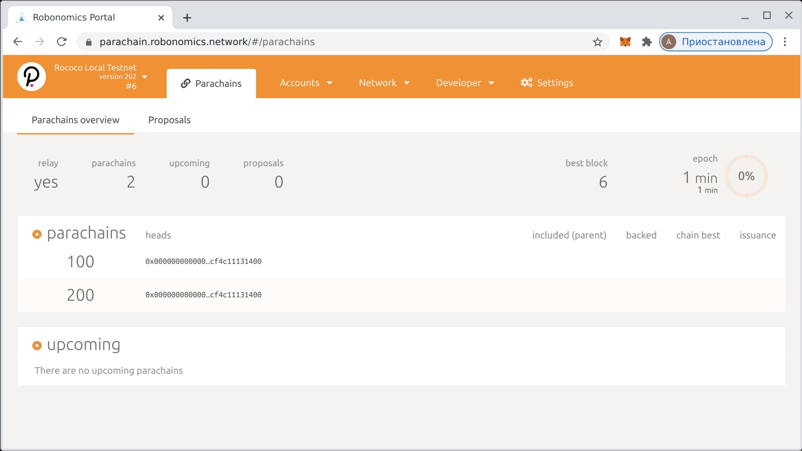
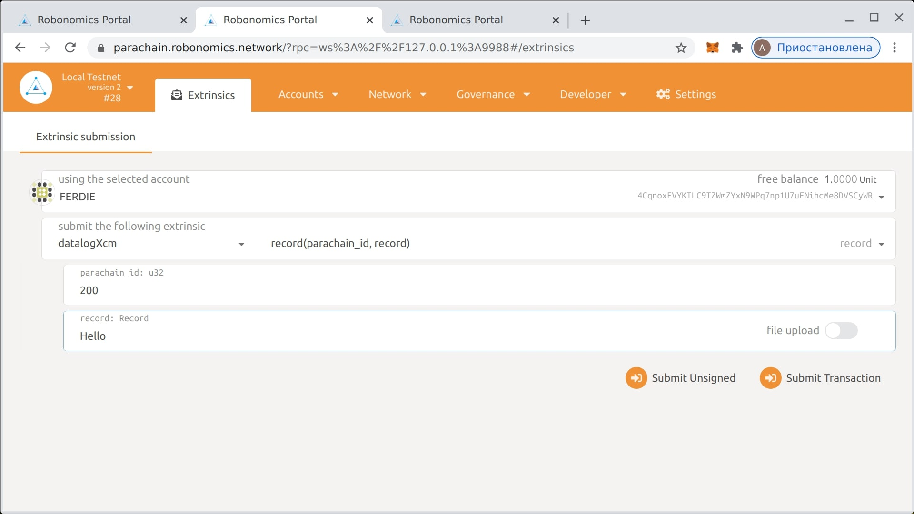

import Asciinema from '~/components/Asciinema.vue'

Robonomics 파라체인은 Polkadot 생태계에서 범용 파라 체인이 아닙니다. Robonomics의 목표는 기계 경제를 구축하는 것이며,이 목표 범위의 파라체인은 Polkadot 생태계를 IoT, 스마트 시티 및 Industry 4.0 개념과 통합하는 데 도움이됩니다.

## 요구 사항

* Docker가 필요합니다. [먼저 설치하십시오](https://docs.docker.com/engine/install/).
* Polkadot-launch가 필요합니다. [설치하십시오](https://github.com/paritytech/polkadot-launch#install).

## 릴레이 시작

공유 보안    릴레이 체인은 Polkadot의 핵심이며 모든 하위 파라체인에 [공유 보](https://wiki.polkadot.network/docs/en/learn-security)을 제공하고 메시지 전달 메커니즘을 구현합니다. 두 개의 Robonomics 기반 파라체인이있는 Rococo (polkadot test net) 릴레이 체인의 로컬 인스턴스를 자식으로 시작해 보겠습니다. 준비된 [Docker 이미지 태그인 "winter-school-2"](https://hub.docker.com/layers/robonomics/robonomics/winter-school-2/images/sha256-92f4795262f3ded3e6a153999d2777c4009106a7d37fd29969ebf1c3a262dc85?context=explore)를 사용하지만 [Robonomics GitHub](https://github.com/airalab/robonomics/tree/master/scripts/polkadot-launch)에서 사용할 수있는 모든 예제 소스 코드를 사용합니다. 

<Asciinema vid="419Jrg22ziFfMFPZlh2WtiLvg"/>

시간이 걸릴 수 있지만 기다려주십시오. 결과적으로 포트에 세 개의 체인 인스턴스가 있어야합니다:

* `9944` - 로컬 로코코 릴레이 체인.
* `9988` - `id=100` 인 robonomics 파라체인
* `9989` - `id=200` 인 robonomics 파라 체인

원격 서버를 사용하는 경우 로컬 시스템에 몇 가지 ssh 터널을 만들어야합니다:
```
ssh -f -N -L 9944:127.0.0.1:9944 root@REMOTE_SERVER_IP
ssh -f -N -L 9988:127.0.0.1:9988 root@REMOTE_SERVER_IP
ssh -f -N -L 9989:127.0.0.1:9989 root@REMOTE_SERVER_IP
```
그런 다음에는 https://parachain.robonomics.network/ 에서 `ws://127.0.0.1:9944`, `ws://127.0.0.1:9988` 및 `ws://127.0.0.1:9989`를 사용할 수 있습니다.


잠시 후에 파라 체인을 등록해야합니다.



그리고 블록 생산을 시작합니다.


다음 단계로 파라체인간에 메시지를 전달하는 HRMP 채널을 만들어 보겠습니다. 릴레이 체인 페이지에서 `sudo` 모듈 호출을 사용하겠습니다.


채널이 생성되면 XCM 호출을 사용할 수 있습니다. `데이터 로그` 팔레트의 XCM 버전인 `datalogXcm` 팔레트를 사용해 보겠습니다.



결과적으로 두 번째 파라체인의 메시지는 데이터 로그 팔레트를 호출하고 데이터를 체인에 기록합니다.


결과적으로이 예제는 XCM을 표준 Robonomics 팔레트의 크로스체인 사용에 사용하는 방법을 보여줍니다.