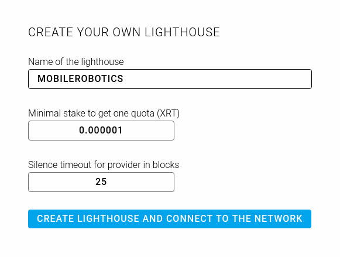
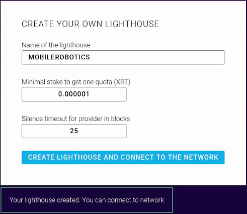
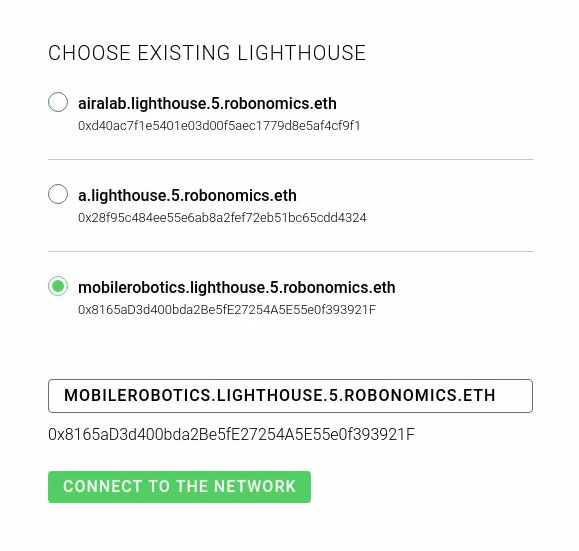
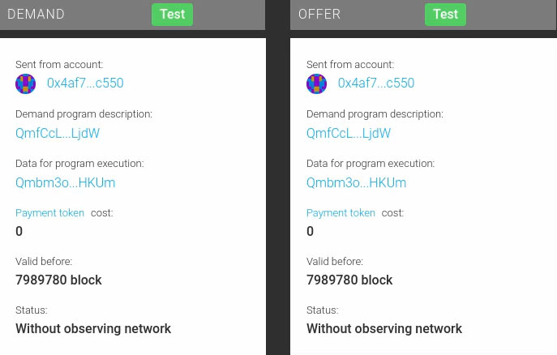
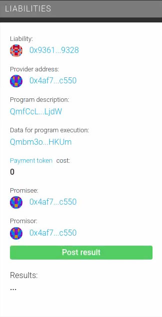

This page describes how to create a lighthouse and become a provider in the Robonomics network.

## Prepare an address

First of all, an Ethereum address is required. You must have access to a private key of the address. In case you don't have one, below are steps to create an address via [Parity](https://www.parity.io/ethereum/).

```
$ sudo snap install parity
$ parity.ethkey generate random
secret:  15abe71557c07b69537bbe4352ed10a057be89037c69d4b35556112519911539
public: 38b800bfd90d486c78c646da79bb94b9d038aca8aad221062ce1b148df7764bfef02f6b3cf931786b6997540b798ea226ae60bd201c222d8f702e408a1a5cbff
address: c531fa8f141493df3da264a864bdcbec19695b4c
```

The `secret` field is a private key, you'll need it to run the provider client. Save it to a file:

```
$ echo '0x15abe71557c07b69537bbe4352ed10a057be89037c69d4b35556112519911539' > private.key
```

The next step is to deposit some ethers and XRT tokens to the address which is held in the `address` field.

## Create a lighthouse

Go to the lighthouse [dapp](https://dapp.robonomics.network/#/lighthouse) and fill in a name in the right side:



Click on the `Create lighthouse and connect to the network` button and sign a transaction. After a while you should see:



Now it's time to put a stake. Select the new lighthouse and click `Connect to the network`:



On this page in the `Provider` section click the `Approve` button, sign a transaction. When it's mined click the `Refill` button and do the same.

## Install the client

Now you need to install [robonomics-tools](https://github.com/airalab/robonomics-tools) at least 0.4.2 version. You can build from the source or do the following steps:

**Make sure you have Nix and Stack installed:**
    
```
$ curl -sSL https://get.haskellstack.org/ | sh
$ curl https://nixos.org/nix/install | sh
```

* Setup Airalab binary cache at [https://aira.cachix.org](https://aira.cachix.org/)
* Import Airalab channel:

```
$ nix-channel --add http://aira.life/channels/aira-unstable/ aira
$ nix-channel --update
```
* Install from the binary cache:

```
$ nix-env -iA aira.robonomics-tools
```
* Run the client:

```
$ xrtd --lighthouse mobilerobotics.lighthouse.5.robonomics.eth --private $(cat private.key)
```

**Get familiar with the `xrtd` options via `xrtd --help`.**

## Test the provider

To test your provider go again to the lighthouse [dapp](https://dapp.robonomics.network/#/lighthouse/) and connect to the just created lighthouse.

At the bottom you should see the `TEST LIGHTHOUSE` section.

Click on the `Demand` button and then on the `Offer` one. You should see something similar to:



Don't forget to sign every message with the MetaMask extension.

Finally you should see a new liability contract created:


